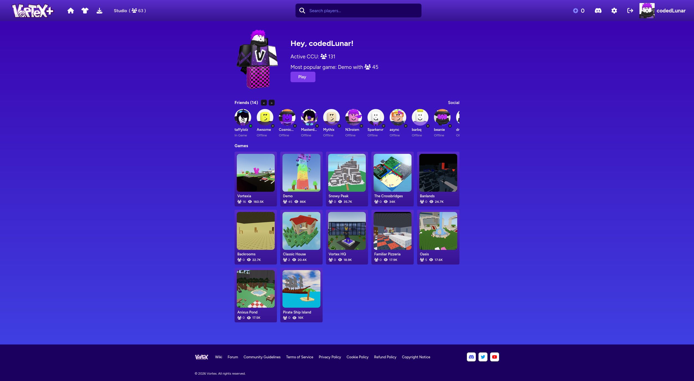
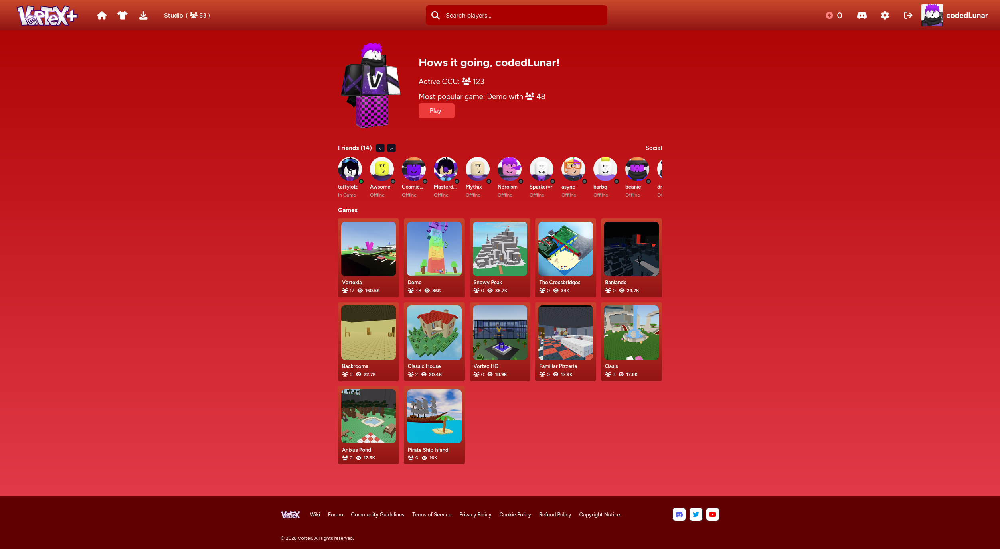
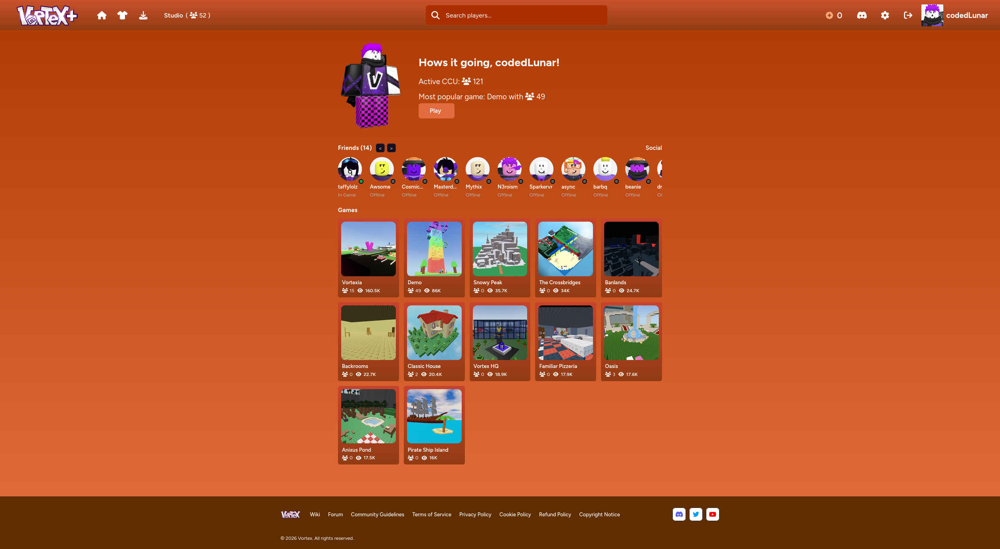
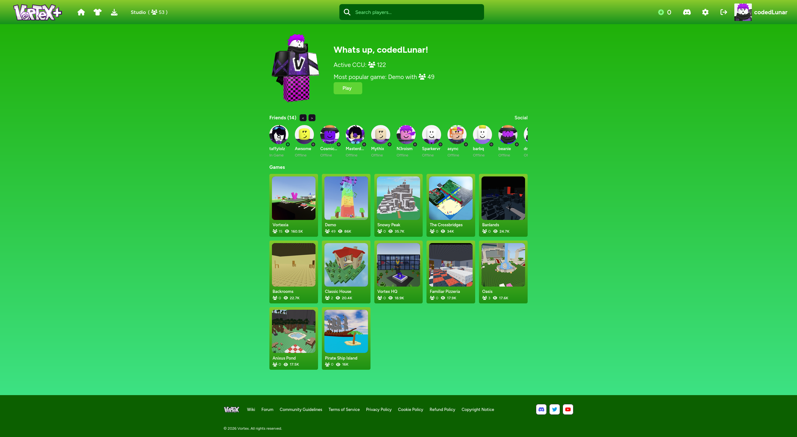
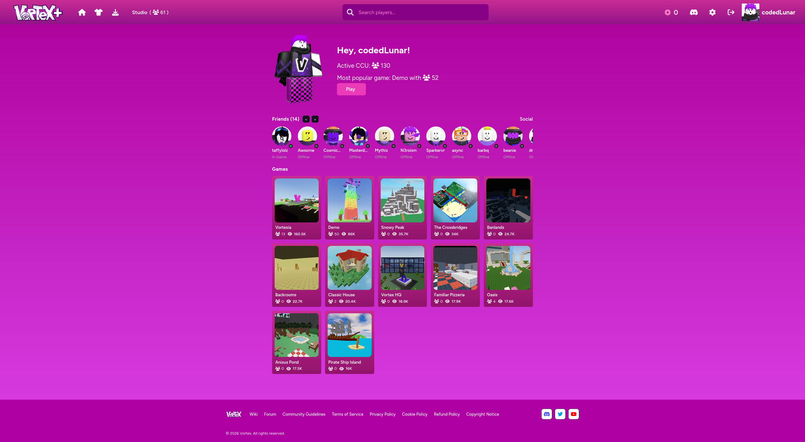
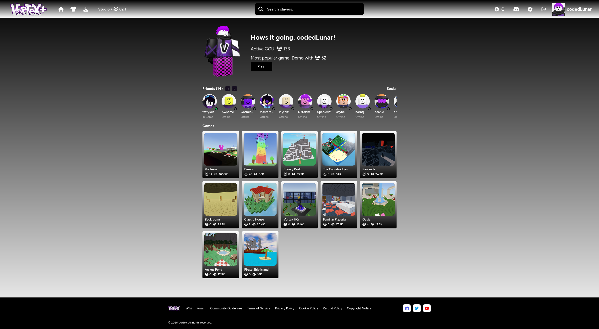

# Vortex+ Browser Extension!
Welcome to the Vortex+ Browser Extension Repository! Vortex+ is a browser extension that adds tons of features, stats, and themes to the vortex website (https://www.playvortex.io)!

It is currently only majorly supported on firefox browsers, but you can try to use it on chrome/chromium if you would like!
*Full chromium/chrome support will be coming in a future update ;)*

**Make sure to use ctrl+shift+r to fully refresh the page for the vortex+ logo to apply.**

(Discord)[https://discord.gg/vQyB2ZNFVA]

By the way, most commits are made in a private repository. This is because if a certain feature is against TOS or in a gray area (which has happened before), I don't want to release it publicly and I especially dont want you guys to use it, because then you could get banned.

Features:

 - Shows amount of visits on a game in the home page
 - Shows profile/icon indicators for online, offline, in-game, in-studio on the home page friends tab
 - Shows the active CCU of vortex
 - Shows the most popular game on vortex, with how many players, with a join button to join it
 - Shows your username on the navbar
 - ⭐ **Themes**
 - ⭐ **Streamer mode that hides sensitive data**
 - ⭐ **Popup configuration for everything!**

Known bugs:

- Sometimes the popup does not show when clicking. **Just spam it until it opens.**
- Catalog, Downloads and Settings pages not working with themes
- Sometimes, the javascript does not load on the main website. Log out, log back in, and hard refresh (ctrl+shift+r)

Vortex+ discord server for announcements, support, and suggestions: (not available yet)
Go follow me on Vortex! (https://www.playvortex.io/users/97707/profile)

AI Disclamer:
AI is sometimes used for debugging and for learning. This project is not vibe coded, however, because I'm not just saying "Hey ChatGPT make me vortex extension", I'm actually writing the code myself. It's just faster to be able to use AI for things im stuck on and things I need to learn. I'm not watching a 30 minute tutorial on how to make a popup, I am busy and have a life, but I will spend 1 quick minute to get a quick boilerplate and edit from there.

Credits:
@Musica (https://www.playvortex.io/users/20498/profile) for the main website inspiration off of their concept! Go follow them!
@TheHaloDeveloper for making Vortex!

All Themes:

**Reminder: Vortex+ is not officially affiliated with playvortex.io in any way.**
